# Sentiment Analysis - Amazon Polarity

## Overview
This sentiment analysis project focuses on understanding and classifying the sentiment expressed in product reviews. The project encompasses three distinct phases, each contributing to the comprehensive sentiment analysis pipeline.
Leveraging a subset of the amazon_polarity dataset, the project employs two powerful models: an LSTM model with GloVe embeddings and a fine-tuned DistilBERT. The LSTM model achieved an accuracy of 80.40%, while the DistilBERT model outperformed with an impressive 90.75% accuracy. Additionally, a user-friendly Streamlit app was developed to provide real-time sentiment analysis capabilities, ensuring seamless deployment for end-users.

**Phase 1: Exploratory Data Analysis (EDA) and LSTM Model**

**Phase 2: Fine-tuning DistilBERT**

**Phase 3: Streamlit App Deployment**

[GitHub](https://github.com/JacobJ215/Sentiment-Analysis-with-DistilBERT/tree/main)

[Notebooks](https://github.com/JacobJ215/Sentiment-Analysis-with-DistilBERT/tree/main/notebooks)

[Demo](https://jacobj215-sentiment-analysis-with-distilbert-app-6dftyk.streamlit.app/)


## Demo App

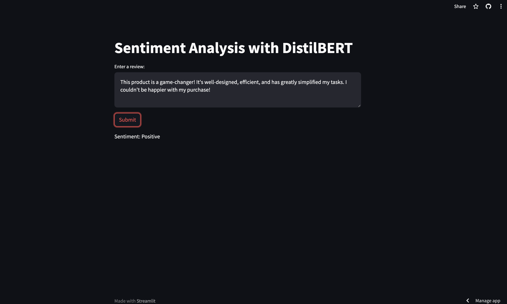

Check out the deployed Streamlit app for live predictions [here](https://jacobj215-sentiment-analysis-with-distilbert-app-6dftyk.streamlit.app/).

## Libraries Used

- Numpy
- Pandas
- Matplotlib
- Seaborn
- Re
- NLTK
- TensorFlow
- Hugging Face's Transformers Library
- Streamlit

## Git Clone and Run the App
1. **Clone the Repository**

    ```
    git clone https://github.com/JacobJ215/Sentiment-Analysis-with-DistilBERT.git
    ```

2. **Install Dependencies**

    ```
    pip install -r requirements.txt
    ```


3. **Run the App**

    ```
    streamlit run app.py
    ```


## Phase 1: Exploratory Data Analysis (EDA) and LSTM Model
In the initial phase, the project commences by delving into the Amazon Polarity dataset sourced from Hugging Face. The dataset undergoes a meticulous process of exploratory data analysis (EDA) to discern the distribution of sentiment, as well as to gather insights into word and sentence lengths.

To facilitate sentiment analysis, a Long Short-Term Memory (LSTM) model is employed, enriched by the integration of GloVe word embeddings. Two variants of the LSTM model are meticulously evaluated - one with 10 epochs, and another with a more robust 100-epoch training cycle. Learning rate scheduling through polynomial decay, coupled with the adam optimizer, is employed to refine the model. Further enhancements include the integration of early stopping, model checkpoints, and tensorboard callbacks. The models are rigorously assessed on the test data and further validated by predicting sentiments in custom reviews.


### Exploratory Data Analysis (EDA) and Preprocessing

**Distribution of Sentiment**

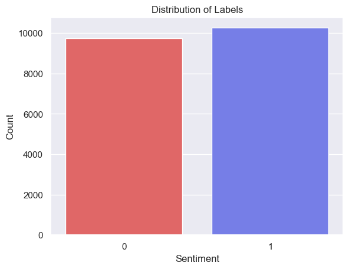


**Distribution of Review Lengths by Sentiment**

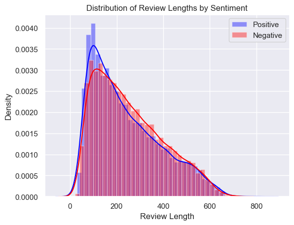

**Distribution of Word Counts in Reviews by Sentiment**

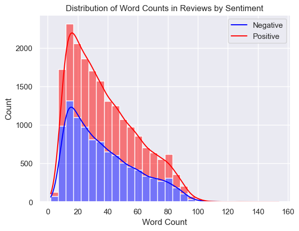

Sentiment seems to bee evenly distributed among the labels. While both "Distribution of Review Lengths by Sentiment" "Distribution of Word Counts in Reviews by Sentiment" are right skewed.  


**GloVe + LSTM**

**Overview of GloVe**

GloVe is a pre-trained word embedding model used to represent words as vectors. It helps in capturing semantic relationships between words.

**Model Architecture**

We use an LSTM (Long Short-Term Memory) neural network combined with GloVe embeddings for sentiment analysis.

```
model = tf.keras.Sequential([
    tf.keras.layers.Embedding(vocab_size, embedding_dim,
        weights=[embedding_matrix], trainable=False),
    tf.keras.layers.Bidirectional(tf.keras.layers.LSTM(150, return_sequences=True)),
    tf.keras.layers.Bidirectional(tf.keras.layers.LSTM(150)),
    tf.keras.layers.Dense(64, activation='relu'),
    tf.keras.layers.Dense(1, activation='sigmoid')
])
```

**Model Training**

We train the LSTM model with different configurations and use polynomial decay for a learning rate scheduler with the Adam optimizer. Callbacks including early stopping, model checkpoint, and tensorboard are used.

```
# Compile the model
model.compile(loss=tf.keras.losses.BinaryCrossentropy(),
            optimizer=optimizer, 
            metrics=['accuracy']
)

# Define callbacks
early_stopping = EarlyStopping(monitor='val_loss', patience=5, restore_best_weights=True)
model_checkpoint = ModelCheckpoint('../models/lstm/best_model.h5', monitor='val_loss', save_best_only=True)
tensorboard_callback = TensorBoard(log_dir='./logs', histogram_freq=1)

# Train the model
history = model.fit(
    train_padded,
    train_labels,
    validation_data=(test_padded, test_labels),
    epochs=100,
    callbacks=[early_stopping, model_checkpoint, tensorboard_callback])

```

**Evaluation and Results**

**Model Evaluation**

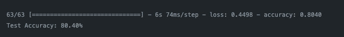

**Accuracy and Loss Plots**

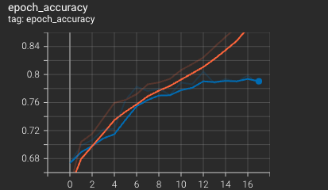


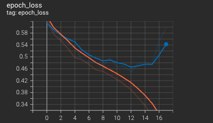

The model begins to diverege around 9 epochs luckily, using our ModelCheckpoint callback we were able so save the best performing model.

**Confusion Matrix**

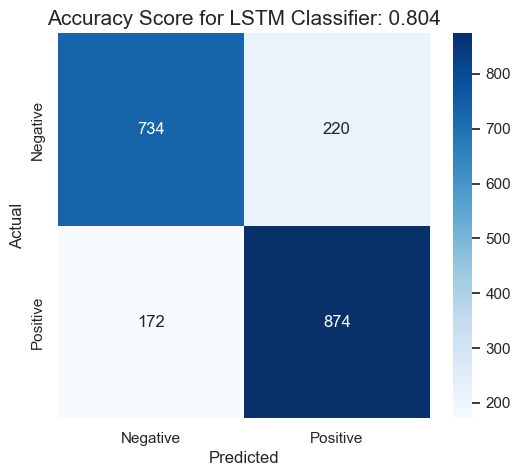


**ROC AUC Curve**

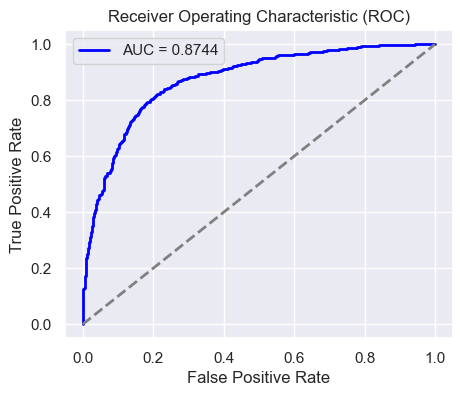

**Predictions**

**Predicting on orginal test data**

Positive Reiviews

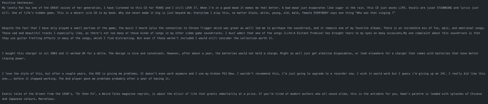


Negative Reiviews

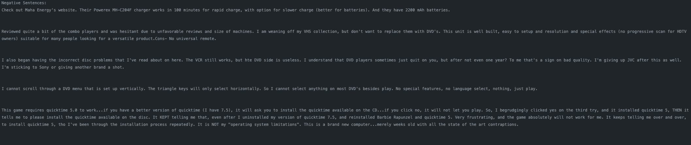

**Predicting on sequenced data**

Positive Reiviews

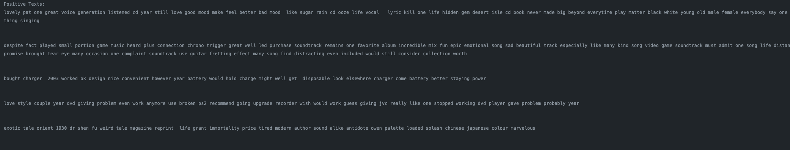


Negative Reiviews

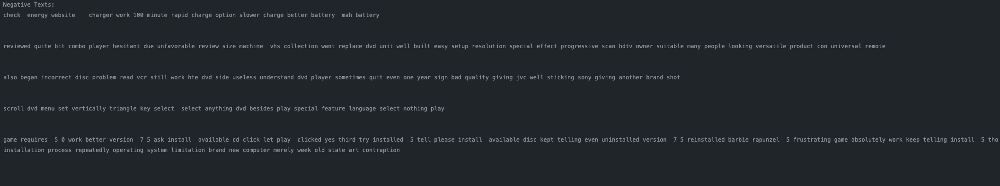

**Predicting on sample text**

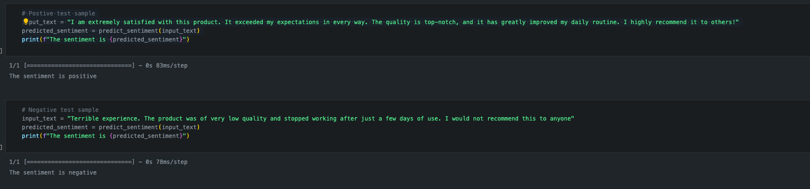

## Phase 2: Fine-tuning DistilBERT
The second phase of the project centers around fine-tuning the DistilBERT model. This process is carried out in Google Colab, leveraging the Amazon Polarity dataset. Upon completion, the fine-tuned model is downloaded and evaluated, mirroring the assessment approach used for the LSTM models. Predictions are generated for both the test data and custom reviews.

**DistilBERT**

DistilBERT is a lightweight version of BERT (Bidirectional Encoder Representations from Transformers) designed for efficient training and deployment.

**Fine-tuning DistilBERT**

We fine-tune DistilBERT on the amazon_polarity dataset. The model was trained on google colabs T4 GLU over 3 epochs while utilizing a PolynomialDecay learning rate scheduler.

**Loading the Model**

```
# Initialize BERT tokenizer and model
model_name = 'distilbert-base-uncased'
tokenizer = DistilBertTokenizer.from_pretrained(model_name)
model = TFDistilBertForSequenceClassification.from_pretrained('../models/fine_tuned_distilbert', num_labels=2)

```


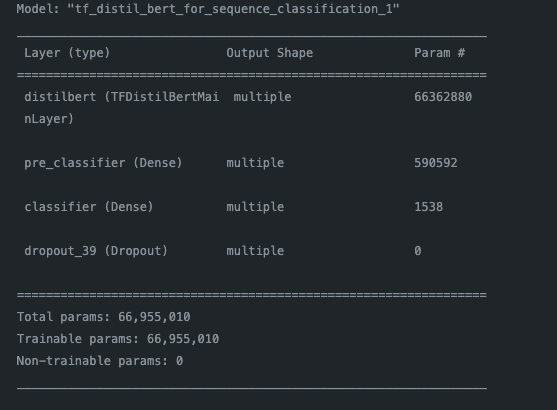

**Model Evaluation**


**Predictions**

**Predicting on orginal test data**

Postive Reviews

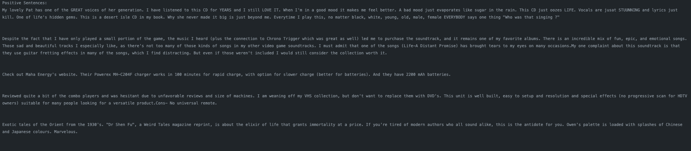

Negative Reviews


**Predicting on sample text**

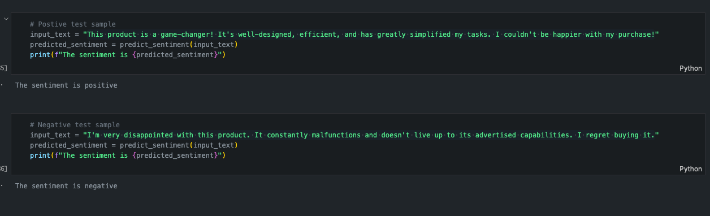


## Phase 3: Streamlit App Deployment
In the final phase, a streamlined user interface is constructed using Streamlit. This frontend empowers users to input reviews and receive instant sentiment predictions. The app is deployed to Streamlit Cloud, ensuring seamless accessibility for end-users at [Demo](https://jacobj215-sentiment-analysis-with-distilbert-app-6dftyk.streamlit.app/)

This project amalgamates rigorous data analysis, machine learning, and natural language processing techniques to deliver a robust sentiment analysis solution. 


## Conclusion

This sentiment analysis project has successfully demonstrated the feasibility and effectiveness of using machine learning models to understand and classify the sentiment expressed in product reviews. The project employed two powerful models, an LSTM model with GloVe embeddings and a fine-tuned DistilBERT model, which achieved impressive accuracies of 80.40% and 90.75%, respectively. 

The project's findings have several potential applications. For example, businesses can use sentiment analysis to track customer satisfaction, identify areas for improvement, and develop more effective marketing campaigns. Additionally, consumers can use sentiment analysis to inform their purchase decisions by understanding the overall sentiment towards specific products or services.

Overall, this project has made a significant contribution to the field of sentiment analysis by demonstrating the effectiveness of machine learning models for understanding and classifying customer sentiment. Additionally, the project has developed a user-friendly tool that makes sentiment analysis accessible to a wider range of users.